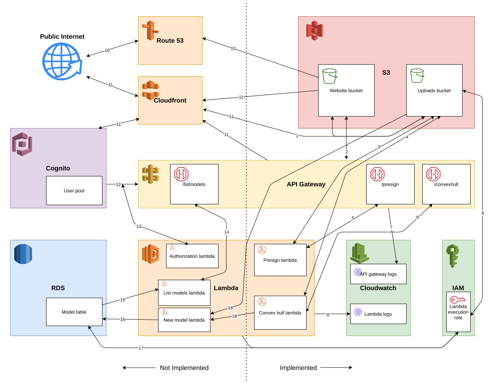

# Distributed Convex Hull
Distributed convex hull cloud service implemented on AWS

---

This is a web application built with various serverless AWS components for ECE465. The overarching goal was to learn more about how to build an application deeply integrated with cloud technologies in a practical way.

This application is a simple web-app that allows you to upload a 3D model .obj file, and calculates the convex hull using [@markus-wa/quickhull-go][quickhull-go]. The website is built using the Vue 3 framework and uses THREE.js for 3D visualzation. This is statically hosted in an S3 bucket (the "website bucket"). The files for the convex hull operation are stored in another bucket (the "uploads bucket"). A user may trigger the upload of a 3D model or the calculation of its convex hull, via a request to the REST API interface created with API Gateway, which calls the lambda integration of the same name.

In the time provided, I was unable to build a full-scale web-application with user/identity support (via AWS Cognito) or database storage (via RDS). AWS Educate also does not support Route 53 nor Cloudfront, so they were also not implemented in the final solution.

For a future iteration, a higher-level website-building service, such as Lightsail, CloudFormation, or Amplify may be much more efficient, since there was a lot of (repetitive) setup for all the permissions to be correct. However, it was a good learning experience to try to set up these serverless components without one of these higher-level services.

See presentation slide deck [here][slides].

See video presentation [here][video].

---

### Build and install into AWS cloud
See [BUILD.md](BUILD.md) and [INSTALL.md](INSTALL.md).

---

### Architecture

<small>

1. Access to uploads bucket by presigned URLs only.
2. Appopriate CORS headers for website use.
3. Presign lambda has read access to uploads bucket.
4. Convex hull lambda has GET/PUT access to uploads bucket.
5. Presign endpoint calls presign lambda.
6. Convex hull endpoint calls convex hull lambda.
7. API Gateway stage has logging set up.
8 Each lambda has logging set up (to different loggroups).
9. Lambdas need access to uploads bucket.
10. Route 53 acts as a DNS server.
11. Cloudfront acts as a CDN for the website, uploads bucket, API Gateway, and authorization page. It also supports HTTPS (necessary for Cognito).
12. Cognito authorizes API requests using the users access token.
13. Authorization lambda verifies the user's access token.
14. Listmodels endpoint calls listmodels lambda.
15. Listmodels lambda retrieves models entries from database.
16. New model lambda creates new model entry in database.
17. Listmodels/Newmodel lambdas require permissions for RDS.
18. On new upload (PUT request) or creation of a hull (a new model), newmodel lambda will trigger.

</small>

---

### Structure of this repository
- [assets/](assets): AWS architecture diagram
- [aws_res/](aws_res): AWS policy files for deploy scripts
- [res/](res): sample files for test usage (e.g., .obj 3D model files)
- [scripts/](scripts): Makefile subscripts for AWS deployment
- [src/](src):
    - [src/chfrontend/](src/chfrontend): Vue 3 application frontend
    - [src/chhull/](src/chhull): convex hull lambda
    - [src/chpresign/](src/chpresign): presign lambda
    - [src/chutil/](src/chutil): util package for generating random keys for lambdas
    - [src/convexhull/](src/convexhull): 2D convexhull implementation*
    - [src/main/](src/main): driver for testing 3-D convex hull locally*
    - [src/objio/](src/objio): util package for reading/dumping .obj 3D files
    - [src/qh3d/](src/qh3d): my own attempt at writing a 3-D quickhull, largely based on the Java QuickHull3D; only got up to creating a simplex*
- [Makefile](Makefile): top-level Makefile and configuration
- [BUILD.md](BUILD.md): build instructions and prerequisites
- [INSTALL.md](INSTALL.md): instructions to deploy to AWS cloud
- [README.md](README.md): this file

*: These files were used when I was testing convex hull, but are not part of the serverless web-app.

[slides]: http://files.lambdalambda.ninja/reports/20-21_spring/ece465_cloud_convex_hull_presentation.pdf
[quickhull-go]: https://github.com/markus-wa/quickhull-go
[video]: https://www.youtube.com/watch?v=XkEnGN_G0ns